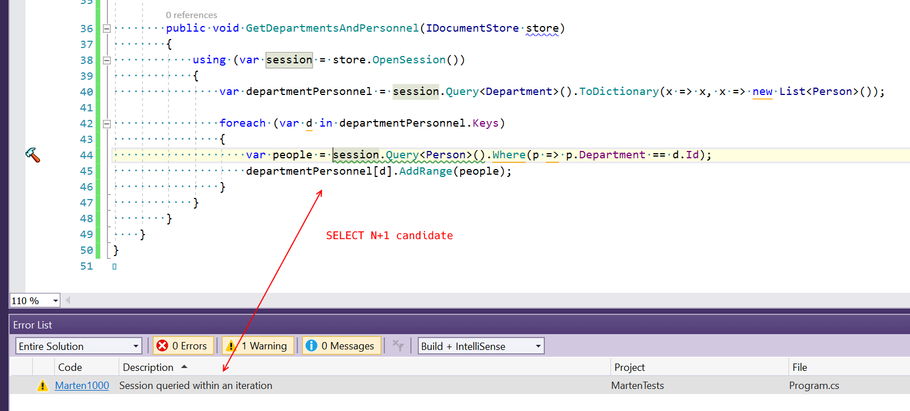

# Marten.Analyzers  
Code Analyzers for [Marten](http://jasperfx.github.io/marten/).

**Package** [Marten.Analyzers](https://www.nuget.org/packages/Marten.Analyzers) | **Platforms** .NET 4.6, .NET Standard 1.3

For rules, see https://jokokko.github.io/marten.analyzers/.

Remarks: The current analyzers exist to identify Select N+1 candidates to aid myself in code reviews.

Note: This is a contributor project.

Some of the structure (docs, unit test helper) is copied from [xunit.analyzers](https://github.com/xunit/xunit.analyzers).